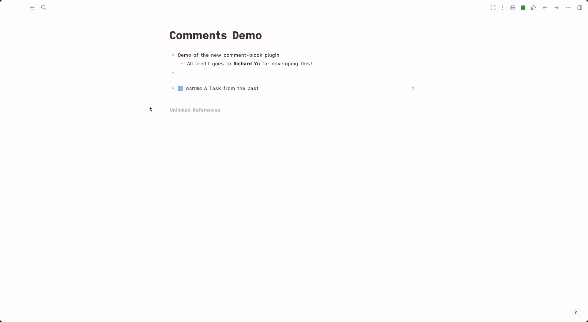

# Logseq Comment Block

For building an automatic comment history for Logseq! You can comment any block and show the connected history on journal page, current page, block ref sidebar and "Comments" page.

So, it should be a workflow of Logseq powered by plugin.

## Inspiration and Thanks

The inspiration of this plugin comes from [our community](https://discord.com/channels/725182569297215569/915076465027055656/915226549857435709) by Bailey Jennings, and likely borrowed from Roam.

## Why need this

If you have a long term plan/job/task, you may need to write down something about it day by day, use this way, you can keep your todo list clean and the progress connected.

Also Bailey made a demo video on Youtube

## Installation

### Preparation

- Click the 3 dots in the righthand corner and go to `Settings`.
- Got to advanced and enable Developer mode.
- Restart the app.
- Click 3 dots and go to `Plugins`.

### Install plugins from Marketplace (recommended)

- Click `Marketplace` button and then click `Plugins`.
- Find the plugin and click `Install`.

### Install plugins manually

- Download released version assets from Github.
- Unzip it.
- Click `Load unpacked plugin`, and select destination directory to the unziped folder.

## Usage

- Trigger `Comment block` from block contextual menu.
- Trigger `/Comment block` from block slash commands.
- Trigger by shortcut `mod+shift+i`, mod means `command` on Mac and means `ctrl` on Windows.

## CAUTION

If you change the `Preferred date format` on Settings page, you will lose your connections between journal and comments.

## ❤️ Buy me a coffee

If you like this plugin and you will, you can choose to buy me a coffee via [this](https://www.buymeacoffee.com/vipzhicheng) and [this](https://afdian.net/@vipzhicheng), that means a lot to me.

## Licence

MIT
